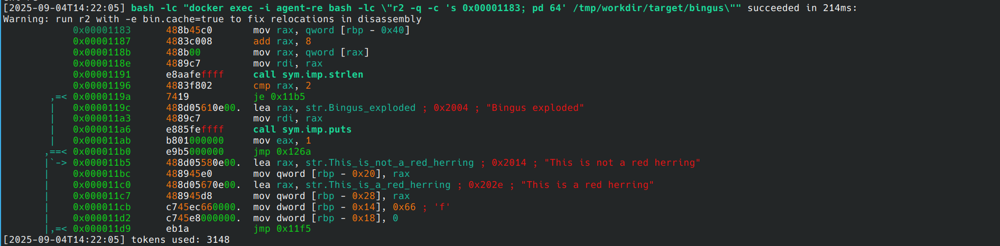

# Vibe Reverser - A reverse engineer AI agent

This agent uses OpenAI's [Codex CLI](https://developers.openai.com/codex/cli/) to perform reverse engineering and cracking tasks.

It runs inside a Docker container based on Ubuntu with root privileges, allowing installation of tools via `apt` and the use of `qemu` for working with binaries from different architectures.



## Disclaimer

Since this is a "vibe style" agent, you should obviously use it with extreme caution - unless you enjoy living dangerously and explaining things to your boss.
Proceed only if you’re comfortable with a little chaos.

## Usage

```
Usage:
  ai.sh --exec <prompt>
  ai.sh --clean-output
  ai.sh --clean-helper
  ai.sh --clean-docker
  ai.sh --clean-all
  ai.sh --help

Details:
  --exec <prompt>
      Runs the agent defined in AGENT_EXEC_CMD passing the <prompt>
      Example:
        ai.sh --exec "Analyze the file ./target/example.elf"

  --clean-output
      Delete ALL contents inside of ./output/.

  --clean-helper
      Delete ALL contents inside of './helper/'.

  --clean-docker
      Delete docker container 'agent-re'.

  --clean-all
      Delete docker container 'agent-re', ALL contents of './output/' and './helper/'.
```

## Docker

To allow commands to be executed as root, a Docker container named `agent-re` is used, based on the official `ubuntu` image. During execution, the AI agent will automatically install the necessary tools inside the container.

If the `agent-re` container does not exist, the AI agent will create it, start it in the background, and shut it down when operations are complete. The container is never removed automatically: to delete it manually, run `./ai.sh --clean-docker`.

> **Note:** The Docker container is launched directly by the agent, so the user running the agent must have sufficient privileges to interact with the Docker daemon (typically by being in the `docker` group or having root access).

The container is started by the agent using the following command:
```
docker run --name agent-re -d -i -v "${PWD}:/tmp/workdir" -w /tmp/workdir --device=/dev/kvm --device=/dev/net/tun --cap-add NET_ADMIN ubuntu bash
```
This setup requires the user to have permissions for device access (`/dev/kvm`, `/dev/net/tun`) and to grant additional capabilities (`NET_ADMIN`). Ensure your user account has the necessary privileges before running the agent.

## Security

Although Docker is used to isolate the environment, there are still security implications.

The `codex` agent runs on the host with the default parameters `--skip-git-repo-check --sandbox danger-full-access` (configured in the `AGENT_EXEC_DEFAULT_PARAMETERS` variable in `ai.sh`).

This configuration grants the agent broad access to the filesystem and disables certain safety checks, so use with caution and only in trusted environments.

> **Warning:**  
> If the Docker daemon is running with elevated privileges (e.g., as root), the agent - by virtue of its access to the Docker socket - could potentially perform container escape techniques and gain root access on the host system.  
> Always ensure you understand the security implications.

[The agent may pown you!](https://gist.github.com/siddolo/827e1cb66fdf1e1e94195a354e48f986)

## Crackme Example

This is an example of cracking a crackme challenge, which can be downloaded from [crackmes.one](https://crackmes.one/crackme/68a153668fac2855fe6fb67b).

You can view the agent-generated report in [Markdown](example/report.md) or [PDF](example/report.pdf).

Here is the target, a simple "bomb" exercise:


The prompt used for this analysis was:

```
Analyze the target file ./target/bingus and find a way to prevent it from exploding without a binary-patch.
```

Starting:


Some magics:


Cracked:


Report:


## Observed Limitations

It performs very well in static analysis. However, when dynamic analysis and runtime debugging are required, it struggles to interact interactively with tools - for example, sending commands to `gdb`. While it can still accomplish these tasks, it does so with some difficulty.

These limitations may be overcome in future codex updates.

> "The future is not set." - John Connor
